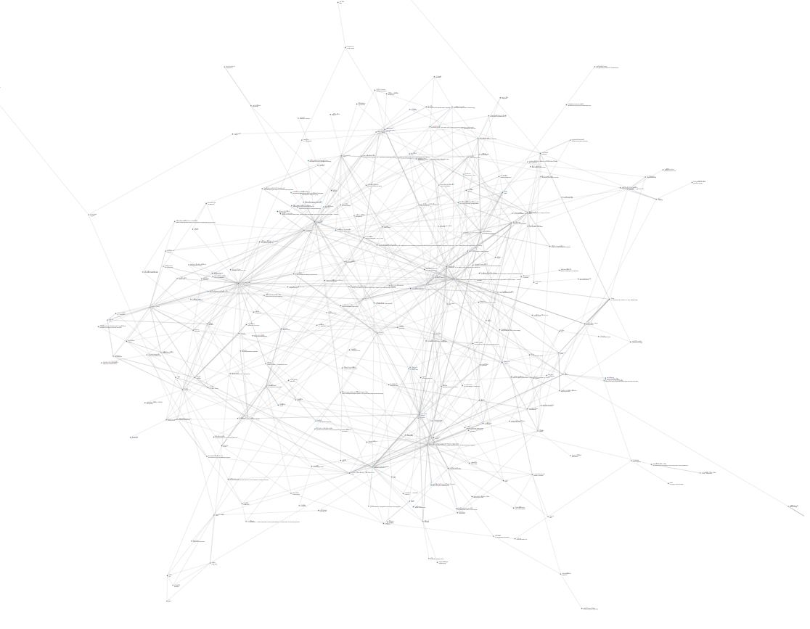

# The Illustrated Manual of Buddhist Terms and Doctrines

The goal of this project is to explore the graph created by mapping the links and references of the book: A Manual of Buddhist Terms and Doctrines

Buddhist Dictionary:
A Manual of Buddhist Terms and Doctrines
By Nyanatiloka Thera

## PDF

- <https://www.buddhistelibrary.org/buddhism-online/e-books/palidictionary.pdf>
- <https://buddhistuniversity.net/content/reference/buddhist-dictionary_nyanatiloka>

## Online Version

- <https://www.palikanon.com/english/wtb/dic_idx.html>

## Bonus

THE ILLUSTRATED HISTORY OF BUDDHISM
by ASHIN JANAKA BHIVAMSA
(Aggamahapandita)
Artist: U Ba Kyi

<https://saraniya.com/buddhism/buddhist-stories/the-illustrated-history-of-buddhism/>
